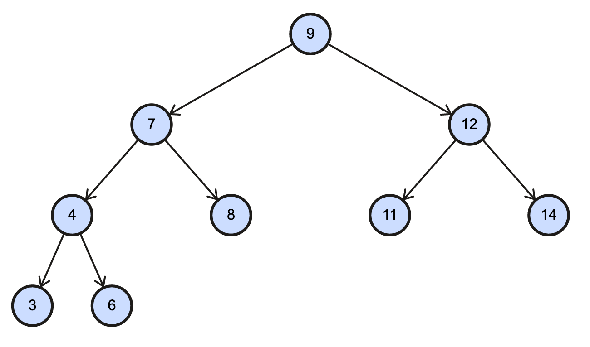

# Homework #2

### Vladimir P. Toussaint

## Binary Search Trees
   
### a) 

In this tree of 9 nodes, there could be an increase in the height (h = 3) that could result more than 3. This can be done by simply by adding a node that is less than 3 (x < 3), or if it is less than 6, but greater than 4 (4 < x < 6). However, adding a node such that it is greater than 9 to the right subtree will meet the given criteria. 
   
   


### b)

Resulting Recurrence Algorithm: $T(n) = 2 T(n / 2) + O(n)$

    ```python
	    BuildBST(array, n, node)
	        if n == 0
	            return NULL
	        median = Select(array, n) # This should result in a O(n) time complexity
	        LeftSubtree = all elements less than median ( x < median )
	        RightSubtree = all elements less than median ( x > median )
	        node.value = median
	        BuildBST(node.left, LeftSubtree, (n - 1) // 2)
	        BuildBST(node.right, RightSubtree, (n - 1) // 2)
	
	        return node
	        BuildBST(array, n, node)
    ```

### c)

The time complexity to loop and insert into the new tree will take $n/2$ considering that an insert for a new node will perform a search which traverse through left subtree or right subtree. As for the height of the tree when performing an insert/search you reach eventually a tree depth where the height can be represented as $log(n)$. The overall time complexity reach for this balanced tree will be: $\Theta(log(n))$

	```python
		for i in old_tree
			if i != yellow
				insert i in new_tree
		
		Search(root, key)
			if root.value == key and root != yellow
				return root
			elif root.value > key
				return Search(root.left, key)
			elif root.value < key
				return Search(root.right, key)
			return NULL		
	```
	
## Red-Black Trees

### a) 

The maximum difference in the number of nodes is at least $2 * x$. The maximum difference for given red nodes for the left subtree to the right subtree is 8 red nodes (NIL).

### b)

The difference in the size of the red-black tree where you'll never have one path of the tree where it is longer than the other path. This is how red-black trees maintain it's balance with a time complexity of $O(log(n))$. So for a general case, the black path will be the shortest, whereas you can have the red-black path alternating between the nodes which result in the longest chain. If the height of this tree is h this results in, the $BlackPath >= NodesonPath / 2$. To justify this, the violation is that you cannot have a tree that has a chain of red nodes. The nodes must be shifted till it is rebalanced to alternating colors or a chain of black nodes.

	```python
		RedBlack Func(node)
			if node == NULL
				return
			if BlackHeight(node) < (height(node) / 2)
				print(node)
			Func(node.left)
			Func(node.right)	
	
		RedBlack Height(root)
			if root == NULL
				return 0
			LeftHeight = Height(root.left)
			RightHeight = Height(root.right)
			return Max(LeftHeight, RightHeight) + 1
		
		RedBlack BlackHeight(root)
			if root == NULL
				return 0
			LeftHeight = BlackHeight(root.left)
			RightHeight = BlackHeight(root.right)
			if root.color == BLACK
				return Max(LeftHeight, RightHeight) + 1
	```


### c)

	```python
		RedBlack BuildRBTree(n, list)
		mid = list[ n / 2 ]
		root = BuildRoot(mid)
		split = n / 2
		LeftSubtree = list[ from 0 to split - 1 ]
		RightSubtree = list [ from split - 1 to n ]
		root.left = BuildRBTree(LeftSubtree, split - 1)
		root.right = BuildRBTree(RightSubtree, split -1)
		return
	```
	

## Augmented BST

### a)

Given a BST created on a set of intervals where the lowest value in the interval used as the key, Delete the interval along with its parent, but if this node has a left child then replace with the left child. The issue here is that you would have a need to recalculate the interval on the rotated nodes, when performing this.

### b)

To justify the algorithm for log(n) we identify several cases here. The first case is if it doesn't have any children, then we delete the node and perform an update to the size on the path to the root. The second case is if it has a single child, then we replace the nodes value with that of its only child and delete that child, then perform an update on the size along the path to the root. The last case is if both children are present we replace the node with the lowest element from the right subtree, then perform a deletion on the lowest element from the right subtree, then perform an update along that path of the tree.


### c)

```python
	arr = []

	SearchNum(x, val)
		if x.low <= val <= x.high
			arr.append(x)
		elif val < x.low
			return arr.append(SearchNum(x.left, val))
		else
			if val < Max(x.left)
				return arr.append(SearchNum(x.left, val))
			elif val > Max(x.left)
				return arr.append(SearchNum(x.right, val))

```


## Dynamic Programming: Coins

### a)

```python
	Funct(i, j, coin, table)
		if i == j
			return coin[i]
		elif i + 1 == j
			return Max(coin[i], coin[j])
		
		if table[i][j] == -1
			 goldA = coin[i] + Min(Funct(coin, i + 2, j, table), Funct(coin, i + 1, j - 1, table))
			 goldB = coin[i] + Min(Funct(coin, i + 1, j - 1, table), Funct(coin, i, j - 2, table))
			 val = table[i][j] = Max(goldA, goldB)
		return val
			  
```

### b)

The way this recursion works is if you select the i'th pot then all is only left to choose from an i + 1 up to j number elements of the coin. If you choose the i + 1 position in the pot you will recursively choose the next i + 2 up to j number of elements. However, if the j'th pot is chosen, then you will recurse and select the i + 1 up to the j - 1 elements and chose the lesser of these two minimums.

coin [ i + 1, ..., j ]
coin [ i + 2, ..., j ]
coin [ i + 1, ..., j - 1 ]
coin [ i ] + Min(Funct(i + 2, j), Funct(i + 1, j - 1)) 

Another case is of the way this recursion works is if you select the j'th pot then all is only left to choose from an i up to j -1 number elements of the coin. If you choose the i pos'th tion in the pot you will recursively choose the next i + 1 up to j - 1 number of elements. However, if the j - 1 pot is chosen, then you will recurse and select the i up to the j - 2 elements and chose the lesser of these two minimums.

coin [ i, ..., j - 1 ]
coin [ i + 1, ..., j - 1 ]
coin [ i, ..., j - 2 ]
coin [ i ] + Min(Funct(i + 1, j), Funct(i, j - 2)) 


## Dynamic Programming: Matrix

Four possible moves from a cell (i, j) when j is even
(i, j + 1)  ||  (i, j - 1)  ||   (i - 1, j + 1)   ||   (i - 1, j - 1)


Four possible moves from a cell (i, j) when j is odd
(i, j + 1)  ||  (i, j - 1)  ||   (i + 1, j + 1)   ||   (i + 1, j - 1)

```python
	MinDelay( matrix, i, j, table)
		if i == 0 and j == 0
	       return matrix[i][j]
	  	if i < 0 or j == len(matrix)
	      return 0 
		if table[i][j] == -1
		d = matrix[i][j]
		d += MinDelay( matrix, i, j - 1)
		d += MinDelay( matrix, i, j + 1)
	
		if j % 2 == 0
			d += Min( MinDelay( matrix, i - 1, j - 1 ), MinDelay( matrix, i - 1, j + 1) )
		else
	      	d += Min( MinDelay( matrix, i + 1, j + 1), MinDelay( matrix, i + 1, j + 1 ) )
		return delay 
	
	TrafficDelay = [[1,2,3], [4,5,6], [7,8,9]]
	TrafficLength = len(TrafficDelay)
	
	MinDelay = Min([MinDelay(TrafficDelay, i, 0) for i in range(TrafficLength)])
```

